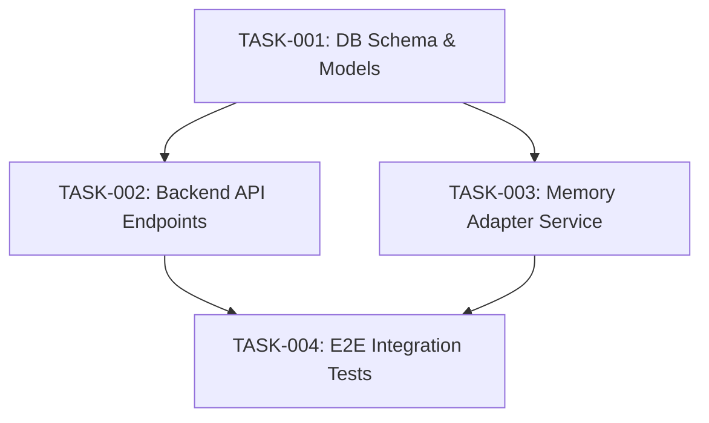

# Breakdown Critic & DAG Validation Rubric

This rubric defines the exact verification checks that the `breakdown-critic` subagent must execute before certifying a task breakdown manifest.

---

## 1. The 6 Rules of Atomic Task Decomposition

Every task in the task manifest must satisfy these six rules:

1. **Atomicity & Size**:
   - Touches no more than **1–3 related files**.
   - Can be completed within a single autonomous agent execution turn without hitting context saturation.
2. **Deterministic Acceptance Criteria**:
   - Contains explicit Given/When/Then assertions.
   - Includes exact verification commands (e.g. `uv run pytest tests/unit/test_task_1.py`).
3. **Explicit Predecessor Dependencies**:
   - Dependencies must cite exact `task_id` values (e.g. `depends_on: ["TASK-001"]`).
   - Tasks with empty dependencies (`depends_on: []`) can run immediately in parallel.
4. **No Circular Blocking (DAG Guarantee)**:
   - Dependency graph must be strictly acyclic. No `A -> B -> A` cycles.
5. **Parallel File Disjointness (Mutex Guarantee)**:
   - Tasks capable of concurrent execution (e.g., sharing the same dependency tier or having `dependencies: []`) MUST touch **mutually exclusive sets of files**.
   - If two tasks must modify the same file (e.g., `fast_api_app.py`), the critic must enforce a sequential dependency (`TASK-001 -> TASK-002`) or merge them into a single atomic task to prevent race conditions during execution.
6. **100% Spec Coverage**:
   - Every BDD scenario in the certified specification must map to at least one task's acceptance criteria.

---

## 2. Deterministic Programmatic Verification (`validate_manifest.py`)

In addition to LLM-level qualitative inspection, the critic executes the deterministic validator CLI tool:

```bash
python3 plugins/agent-factory/skills/spec-council-engine/scripts/validate_manifest.py \
  docs/specs/<feature_dir>/TASK_MANIFEST.md \
  --spec docs/specs/<feature_dir>/SPECIFICATION.md
```

### Automated Checks Performed:
* **DAG Topology & Acyclicity**: Constructs adjacency matrix and validates topological ordering without cycles.
* **Atomicity Check**: Scans bullet points under `Target Files to Create/Modify` and flags tasks exceeding 3 files.
* **Parallel File Mutex**: Computes all reachable downstream tasks and checks file overlap across all pairs of tasks capable of concurrent execution.
* **BDD Completeness**: Verifies `Given / When / Then` presence and runnable `Verification Command` for each task card.
* **Coverage Verification**: Matches `AC[0-9]+` tags in `SPECIFICATION.md` against the generated manifest.

---

## 3. Task Manifest Layout Template (`TASK_MANIFEST.md`)

```markdown
# TASK MANIFEST: [FEATURE-NAME]

**Source Spec:** `docs/specs/[feature_name]/SPECIFICATION.md`
**Total Tasks:** 4
**Critical Path Depth:** 3 levels

## Dependency Graph (Mermaid DAG)



---

## Task Breakdown Cards

### 📌 TASK-001: Create Preference Data Models & Storage Schema
* **Subsystem:** Database / Domain Models
* **Assigned Specialist:** `database_specialist`
* **Dependencies:** None (`[]`)
* **Files to Touch:**
  * `agents/luncher_agent/app/models/preferences.py`
  * `tests/unit/test_preference_models.py`
* **Acceptance Criteria (BDD):**
  * **Given** a user ID and dietary tag list, **When** `UserPreference.validate()` is called, **Then** valid enum attributes are parsed.
* **Verification Command:** `uv run pytest tests/unit/test_preference_models.py`

---

### 📌 TASK-002: Implement Filter API Endpoint
* **Subsystem:** Backend API
* **Assigned Specialist:** `backend_specialist`
* **Dependencies:** `["TASK-001"]`
* **Files to Touch:**
  * `agents/luncher_agent/app/fast_api_app.py`
  * `tests/unit/test_filter_endpoint.py`
* **Acceptance Criteria (BDD):**
  * **Given** user preferences stored, **When** `GET /api/v1/recommendations` is queried with filter flag, **Then** only compliant restaurants are returned.
* **Verification Command:** `uv run pytest tests/unit/test_filter_endpoint.py`

---

### 📌 TASK-003: Update Luncher Orchestrator Synthesis Node
* **Subsystem:** Agent Orchestration
* **Assigned Specialist:** `agent_orchestration_specialist`
* **Dependencies:** `["TASK-001"]`
* **Files to Touch:**
  * `agents/luncher_agent/app/agent.py`
  * `tests/unit/test_agent_synthesis.py`
* **Acceptance Criteria (BDD):**
  * **Given** dietary constraints in session context, **When** `propose_lunch` runs, **Then** dietary compliance tags are attached to A2UI card.
* **Verification Command:** `uv run pytest tests/unit/test_agent_synthesis.py`

---

### 📌 TASK-004: End-to-End Test Suite & Verification
* **Subsystem:** QA / Verification
* **Assigned Specialist:** `qa_specialist`
* **Dependencies:** `["TASK-002", "TASK-003"]`
* **Files to Touch:**
  * `tests/eval/dietary_compliance.py`
* **Acceptance Criteria (BDD):**
  * **Given** full orchestrator running, **When** mock user with nut allergy requests lunch, **Then** returned lunch proposal strictly omits nut-containing venues.
* **Verification Command:** `uv run pytest tests/eval/dietary_compliance.py`
```
