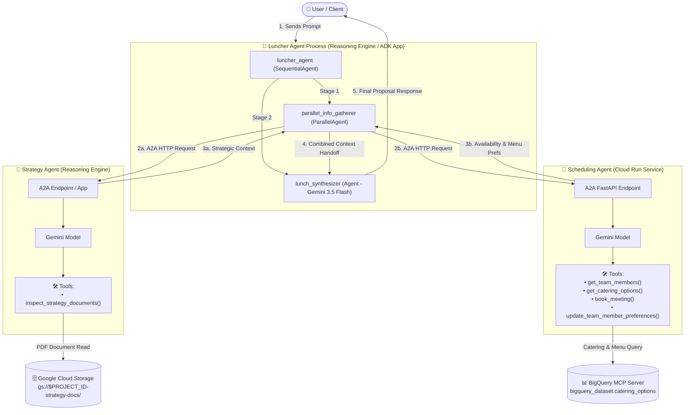

# 🍔 Luncher: Multi-Agent Orchestration Engine

Luncher is an enterprise multi-agent application built on the **Google Agent Development Kit (ADK) v2** and **Agent-to-Agent (A2A) protocol**.

It coordinates strategy-aligned team lunch meetings by orchestrating two specialized sub-agents:
- 🎯 **Strategy Agent** (`strat_agent`): Analyzes corporate strategy documents and product launch roadmaps.
- 📅 **Scheduling Agent** (`sched_agent`): Coordinates team member availability, dietary constraints, and catering choices.
- 👑 **Luncher Orchestrator** (`luncher_agent`): The primary user-facing frontend agent that delegates tasks to the Strategy and Scheduling agents and synthesizes cohesive recommendations.

---

## 📝 TODO / Future Architecture Enhancements

- 📄 **Strategy Documents in Google Cloud Storage (GCS)**: Update `strat_agent` to dynamically ingest and query corporate strategy PDF documents directly from a designated GCS bucket (`gs://$GOOGLE_CLOUD_PROJECT_ID-strategy-docs/`), enabling real-time document search and automated PDF RAG processing.
- 🥗 **Catering Options & Menu Schema in BigQuery via MCP**: Integrate a **BigQuery Model Context Protocol (MCP)** server into `sched_agent` (`scheduling_agent`). This will allow `sched_agent` to query live vendor menus, dietary compatibility flags, and team ordering history stored in BigQuery (`bigquery_dataset.catering_options`) to demonstrate real-world MCP database tool integration.

---

## 🏛️ Agent Architecture Diagram

The following diagram illustrates the multi-agent orchestration workflow. Note that the **Luncher Synthesizer Agent** (`lunch_synthesizer`) is compiled into the same process/binary as the **Luncher Orchestrator** (`luncher_agent`), executing sequentially after parallel info gathering from external A2A sub-agents:



---

## 📑 Table of Contents

1. [Section 1: Setup & Initialization](#1-setup--initialization)
2. [Section 2: Running & Testing Agents Locally](#2-running--testing-agents-locally)
3. [Section 3: Deploying to Cloud & Agent Platform Playground](#3-deploying-to-cloud--agent-platform-playground)

---

## 1. 🛠️ Setup & Initialization

### 📌 Prerequisites

Ensure you have the following CLI tools installed on your system:
- **Google Cloud SDK (`gcloud`)**: [Install Guide](https://cloud.google.com/sdk/docs/install)
- **Google `agents-cli`**: Install via `pip install agents-cli` or `uv tool install agents-cli`
- **`uv` Package Manager**: [Install Guide](https://docs.astral.sh/uv/)

Authenticate `gcloud` before running the setup scripts:
```bash
gcloud auth login
gcloud auth application-default login
```

---

### 🛠️ 3-Step Project Setup

Run the following three shell scripts in order from the repository root:

#### Step 1: Configure Environment Variables (`01-setup-env.sh`)
```bash
./scripts/01-setup-env.sh
```

* **Main Takeaway**: Checks CLI prerequisites (`gcloud`, `agents-cli`, `uv`), prompts for your GCP project credentials, configures `gcloud` defaults, and generates the root `.env` file.
* **Environment Variables Configured**:
  | Variable | Description | Default / Example |
  | :--- | :--- | :--- |
  | `GOOGLE_GENAI_USE_VERTEXAI` | Forces Google GenAI SDK to route via Gemini Enterprise Agent Platform (GEAP) rather than Google AI Studio | `"true"` |
  | `GOOGLE_CLOUD_PROJECT_ID` | Your target Google Cloud Project ID | `"your-gcp-project-id"` |
  | `GOOGLE_CLOUD_LOCATION` | Primary GCP deployment region | `"us-central1"` |

---

#### Step 2: Enable Google Cloud APIs (`02-init-api.sh`)
```bash
./scripts/02-init-api.sh
```

* **Main Takeaway**: Enables all required Google Cloud API services in your GCP project.
* **Enabled APIs Summary**:
  | API Service | Purpose |
  | :--- | :--- |
  | `aiplatform.googleapis.com` | Gemini Enterprise Agent Platform (GEAP) Agent Runtime & Reasoning Engines |
  | `run.googleapis.com` | Cloud Run serverless container hosting for agents |
  | `artifactregistry.googleapis.com` | Container image storage repository |
  | `cloudbuild.googleapis.com` | Cloud Build automated container image compilation |
  | `iam.googleapis.com` | Identity and Access Management service |
  | `cloudresourcemanager.googleapis.com` | GCP Project metadata & policy management |
  | `storage.googleapis.com` | Google Cloud Storage buckets for PDF documents and artifacts |
  | `serviceusage.googleapis.com` | Service usage API management |
  | `servicecontrol.googleapis.com` | Control plane reporting for GCP services |

---

#### Step 3: Configure IAM Permissions (`03-setup-iam.sh`)
```bash
./scripts/03-setup-iam.sh
```

* **Main Takeaway**: Grants necessary project-level IAM roles to Google Cloud runtime service accounts so agents, container runtimes, and build pipelines can execute seamlessly.
* **Service Accounts & Granted IAM Roles**:

  ##### 1. Gemini Enterprise Agent Platform (GEAP) Reasoning Engine Service Agent
  `service-${PROJECT_NUMBER}@gcp-sa-aiplatform-re.iam.gserviceaccount.com`
  - **`roles/aiplatform.user`** (*Agent Platform User*): Allows Reasoning Engine to execute models and manage sessions.
  - **`roles/agentregistry.viewer`** (*Agent Registry API Viewer*): Allows agent card discovery across registered A2A sub-agents.
  - **`roles/run.invoker`** (*Cloud Run Invoker*): Allows Reasoning Engine to invoke sub-agents deployed on Cloud Run.
  - **`roles/aiplatform.reasoningEngineServiceAgent`** (*Gemini Enterprise Agent Platform Reasoning Engine Service Agent*): Standard Reasoning Engine operational role.

  ##### 2. Compute Service Account (Cloud Run Runtime)
  `${PROJECT_NUMBER}-compute@developer.gserviceaccount.com`
  - **`roles/storage.admin`** (*Storage Admin*): Access strategy document PDFs and GCS log artifacts.
  - **`roles/artifactregistry.admin`** (*Artifact Registry Admin*): Pull container images for Cloud Run.
  - **`roles/logging.logWriter`** (*Logs Writer*): Write agent trace logs and telemetry to Cloud Logging.
  - **`roles/run.invoker`** (*Cloud Run Invoker*): Allows Cloud Run agent instances to invoke peer A2A Cloud Run services.

  ##### 3. Cloud Build Service Account
  `${PROJECT_NUMBER}@cloudbuild.gserviceaccount.com`
  - **`roles/artifactregistry.admin`** (*Artifact Registry Admin*): Push built container images to Artifact Registry.

---

## 2. 💻 Running & Testing Agents Locally

To test the multi-agent orchestration locally, start the two sub-agents in background terminals, then launch the primary orchestrator in interactive web playground mode (or CLI mode). All commands execute directly from the repository root.

### Step 1: Start the Sub-Agents

Open **2 separate terminal windows/tabs** to start the Strategy and Scheduling sub-agents from root:

```bash
# Terminal 1: Start Strategy Agent (Port 8081)
uv --directory agents/strat_agent run main.py

# Terminal 2: Start Scheduling Agent (Port 8082)
uv --directory agents/sched_agent run main.py
```

---

### Step 2: Launch Orchestrator Agent in Interactive Mode

With the sub-agents running, open a **3rd terminal window** to launch the Luncher Orchestrator from root:

#### Option A: Interactive ADK Web Playground (`adk web`)
```bash
# Terminal 3: Launch ADK Web UI for Luncher Orchestrator (Port 8080)
uv run adk web agents/luncher_agent --port 8080
```
1. Open **`http://localhost:8080`** in your browser.
2. Enter prompts such as:
   > *"Plan a team lunch meeting for next week that aligns with our corporate strategy."*
3. Watch the orchestrator delegate tasks to the Strategy (Port 8081) and Scheduling (Port 8082) sub-agents in real time.

#### Option B: Terminal CLI (`agents-cli run`)
Alternatively, run the orchestrator interactively from your terminal:
```bash
uv run agents-cli run agents/luncher_agent "Plan a team lunch meeting for next week"
```

---

## 3. ☁️ Deploying to Cloud & Agent Platform Playground

Once tested locally, deploy your agents to **Gemini Enterprise Agent Platform (GEAP) Agent Runtime** or **Cloud Run** and interact with them in the Cloud Console. All deployment commands below execute directly from the repository root.

### Step 1: Deploying Agents to Google Cloud

In this multi-agent architecture:
- 🎯 **Strategy Agent** (`strat_agent`) & 👑 **Luncher Orchestrator** (`luncher_agent`) deploy to **Gemini Enterprise Agent Platform (GEAP) Agent Runtime**.
- 📅 **Scheduling Agent** (`sched_agent`) specifically deploys as a containerized service on **Cloud Run**.

```bash
# Source environment variables first
source .env

# 1. Deploy Strategy Agent (Agent Runtime)
(cd agents/strat_agent && agents-cli deploy --project $GOOGLE_CLOUD_PROJECT_ID --region $GOOGLE_CLOUD_LOCATION)

# 2. Deploy Scheduling Agent (Cloud Run)
(cd agents/sched_agent && agents-cli deploy --deployment-target cloud_run --project $GOOGLE_CLOUD_PROJECT_ID --region $GOOGLE_CLOUD_LOCATION)

# 3. Deploy Luncher Orchestrator (Agent Runtime)
(cd agents/luncher_agent && agents-cli deploy --project $GOOGLE_CLOUD_PROJECT_ID --region $GOOGLE_CLOUD_LOCATION)
```

---

### Step 2: Testing in the Agent Platform Playground & Console

After deployment, explore and interact with your live agents in the Google Cloud Console:

1. **Gemini Enterprise Agent Platform (GEAP) Playground**:
   - Go to **GCP Console > Gemini Enterprise Agent Platform (GEAP) > Reasoning Engines**.
   - Select your deployed `luncher_agent` instance.
   - Use the built-in **Test Playground** pane to send prompts and inspect multi-agent orchestration responses in real time.

2. **Agent Registry (Beta)**:
   - Go to **GCP Console > Gemini Enterprise Agent Platform (GEAP) > Agent Registry**.
   - View registered A2A agent cards, capabilities, and open endpoints.

3. **Cloud Observability & Execution Traces**:
   - Go to **GCP Console > Logging > Log Explorer** or **Cloud Trace**.
   - View detailed execution logs, span attributes, and reasoning steps for each agent turn.

---

## 🗑️ Cleanup

To delete deployed cloud resources and prevent ongoing charges, run the cleanup commands using your environment variables:

```bash
source .env

# 1. Delete Scheduling Agent (Cloud Run)
gcloud run services delete sched-agent --region $GOOGLE_CLOUD_LOCATION --project $GOOGLE_CLOUD_PROJECT_ID --quiet

# 2. Delete Strategy Agent & Luncher Orchestrator (Reasoning Engines)
gcloud ai reasoning-engines list --region $GOOGLE_CLOUD_LOCATION --project $GOOGLE_CLOUD_PROJECT_ID
```
