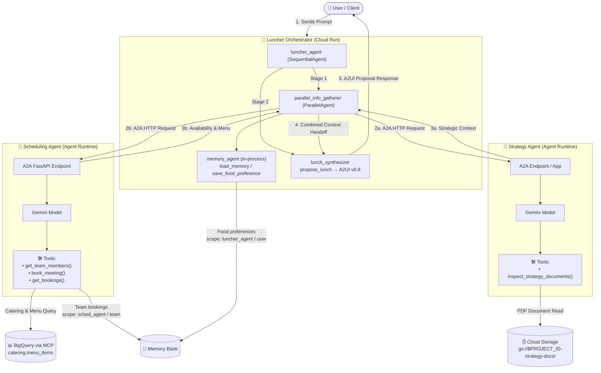
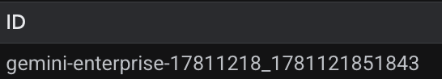
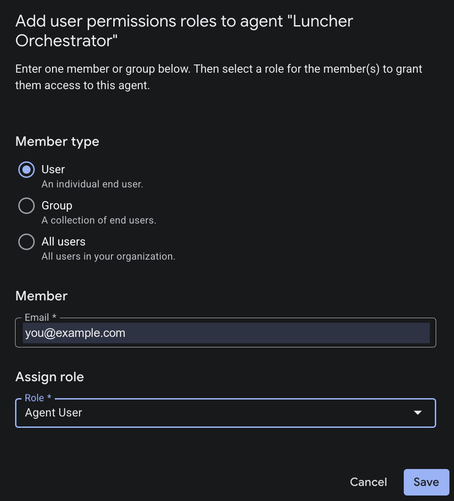

# 🍔 Luncher: Multi-Agent Orchestration Engine

Luncher is an enterprise multi-agent application built on the **Google Agent Development Kit (ADK) v2** and **Agent-to-Agent (A2A) protocol**.

It coordinates strategy-aligned team lunch meetings by orchestrating two specialized sub-agents:
- 🎯 **Strategy Agent** (`strat_agent`): Analyzes corporate strategy documents and product launch roadmaps.
- 📅 **Scheduling Agent** (`sched_agent`): Coordinates team member availability, dietary constraints, and catering choices.
- 👑 **Luncher Orchestrator** (`luncher_agent`): The primary user-facing frontend agent that delegates tasks to the Strategy and Scheduling agents and synthesizes cohesive recommendations.

---

## 🏛️ Agent Architecture Diagram

Stage 1 gathers from three sub-agents concurrently: `memory_agent` runs in-process,
while `strategy_agent` and `scheduling_agent` are remote A2A peers. Stage 2's
`lunch_synthesizer` runs in the orchestrator's own process and renders the A2UI
surface — which is why the orchestrator must be on Cloud Run (see Step 1).



---

## 📑 Table of Contents

1. [Section 1: Setup & Initialization](#1-setup--initialization)
2. [Section 2: Running & Testing Agents Locally](#2-running--testing-agents-locally)
3. [Section 3: Deploying to Cloud & Agent Platform Playground](#3-deploying-to-cloud--agent-platform-playground)

---

## 1. 🛠️ Setup & Initialization

### 📌 Prerequisites

Ensure you have the following CLI tools installed on your system:
- **Google Cloud SDK (`gcloud`)**: [Install Guide](https://cloud.google.com/sdk/docs/install)
- **Google `agents-cli`**: Install via `pip install google-agents-cli` or `uv tool install google-agents-cli`
- **`uv` Package Manager**: [Install Guide](https://docs.astral.sh/uv/)

Authenticate `gcloud` before running the setup scripts. `--update-adc` writes
Application Default Credentials in the same pass, which is what the agents and
the Google client libraries use:
```bash
gcloud auth login --update-adc
```

---

### 🛠️ Project Setup

Run the following shell scripts in order from the repository root.

#### Step 1: Configure Environment Variables (`01-setup-env.sh`)
```bash
./scripts/01-setup-env.sh
```

* **Main Takeaway**: Checks CLI prerequisites (`gcloud`, `agents-cli`, `uv`), prompts for your GCP project credentials, configures `gcloud` defaults, and generates the root `.env` file.
* **Environment Variables Configured**:
  | Variable | Description | Default / Example |
  | :--- | :--- | :--- |
  | `GOOGLE_GENAI_USE_VERTEXAI` | Forces Google GenAI SDK to route via Gemini Enterprise Agent Platform (GEAP) rather than Google AI Studio | `"true"` |
  | `GOOGLE_CLOUD_PROJECT_ID` | Your target Google Cloud Project ID | `"your-gcp-project-id"` |
  | `GOOGLE_CLOUD_LOCATION` | Primary GCP deployment region (Cloud Run, Reasoning Engine) | `"us-central1"` |
  | `GOOGLE_GENAI_LOCATION` | Location for Vertex AI Gemini model inference API calls | `"global"` |
  | `GOOGLE_GENAI_MODEL` | Gemini model used by all agents | `"gemini-3.6-flash"` |
  | `BIGQUERY_LOCATION` | Location of the BigQuery `catering` dataset | `"US"` |

* **Optional Variables** (not prompted for):
  | Variable | Description | Example |
  | :--- | :--- | :--- |
  | `BIGQUERY_MCP_COMMAND` | BigQuery MCP server command used by `sched_agent` | `"$PWD/agents/sched_agent/scripts/mock-bigquery-mcp"` |
  | `STRATEGY_DOCS_BUCKET` | GCS bucket holding the strategy PDFs read by `strat_agent` | `"your-gcp-project-id-strategy-docs"` |
  | `LOG_LEVEL` | Verbosity of the orchestrator's own logs. `INFO` adds a line per A2A event naming the agent that authored it and whether it was withheld | `"WARNING"` |
  | `STRATEGY_AGENT_URL` | Agent card URL of `strat_agent`, used by the orchestrator over A2A | resolved at deploy time |
  | `SCHEDULING_AGENT_URL` | Agent card URL of `sched_agent`, used by the orchestrator over A2A | resolved at deploy time |
  | `GOOGLE_CLOUD_AGENT_ENGINE_ID` | Engine holding **this** agent's sessions and Memory Bank. Injected on Agent Runtime; must be set explicitly on Cloud Run | resolved at deploy time |

---

#### Step 2: Enable APIs and Provision Resources (`02-init-api.sh`)
```bash
./scripts/02-init-api.sh
```

* **Main Takeaway**: Enables the required Google Cloud APIs, creates the BigQuery
  `catering` dataset and loads the menu data, and creates the Agent Engine that
  holds the orchestrator's sessions and Memory Bank.
* **Enabled APIs Summary**:
  | API Service | Purpose |
  | :--- | :--- |
  | `aiplatform.googleapis.com` | Gemini Enterprise Agent Platform (GEAP) Agent Runtime & Reasoning Engines |
  | `run.googleapis.com` | Cloud Run serverless container hosting for agents |
  | `artifactregistry.googleapis.com` | Container image storage repository |
  | `cloudbuild.googleapis.com` | Cloud Build automated container image compilation |
  | `compute.googleapis.com` | Provides the default compute service account Cloud Run runs as |
  | `bigquery.googleapis.com` | The `catering` dataset queried over MCP by `sched_agent` |
  | `apphub.googleapis.com` | Backs the Dashboard tab on an Agent Platform deployment |
  | `iam.googleapis.com` | Identity and Access Management service |
  | `cloudresourcemanager.googleapis.com` | GCP Project metadata & policy management |
  | `storage.googleapis.com` | Google Cloud Storage buckets for PDF documents and artifacts |
  | `serviceusage.googleapis.com` | Service usage API management |
  | `servicecontrol.googleapis.com` | Control plane reporting for GCP services |

---

#### Step 3: Configure IAM Permissions (`03-setup-iam.sh`)
```bash
./scripts/03-setup-iam.sh
```

* **Main Takeaway**: Grants necessary project-level IAM roles to Google Cloud runtime service accounts so agents, container runtimes, and build pipelines can execute seamlessly.
* **Service Accounts & Granted IAM Roles**:

  ##### 1. Gemini Enterprise Agent Platform (GEAP) Reasoning Engine Service Agent
  `service-${PROJECT_NUMBER}@gcp-sa-aiplatform-re.iam.gserviceaccount.com`
  - **`roles/aiplatform.user`** (*Agent Platform User*): Allows Reasoning Engine to execute models and manage sessions.
  - **`roles/agentregistry.viewer`** (*Agent Registry API Viewer*): Allows agent card discovery across registered A2A sub-agents.
  - **`roles/run.invoker`** (*Cloud Run Invoker*): Allows Reasoning Engine to invoke sub-agents deployed on Cloud Run.
  - **`roles/aiplatform.reasoningEngineServiceAgent`** (*Gemini Enterprise Agent Platform Reasoning Engine Service Agent*): Standard Reasoning Engine operational role.

  ##### 2. Compute Service Account (Cloud Run Runtime)
  `${PROJECT_NUMBER}-compute@developer.gserviceaccount.com`
  - **`roles/storage.admin`** (*Storage Admin*): Access strategy document PDFs and GCS log artifacts.
  - **`roles/artifactregistry.admin`** (*Artifact Registry Admin*): Pull container images for Cloud Run.
  - **`roles/logging.logWriter`** (*Logs Writer*): Write agent trace logs and telemetry to Cloud Logging.
  - **`roles/run.invoker`** (*Cloud Run Invoker*): Allows Cloud Run agent instances to invoke peer A2A Cloud Run services.

  ##### 3. Cloud Build Service Account
  `${PROJECT_NUMBER}@cloudbuild.gserviceaccount.com`
  - **`roles/artifactregistry.admin`** (*Artifact Registry Admin*): Push built container images to Artifact Registry.

---


## 2. 💻 Running & Testing Agents Locally

To test the multi-agent orchestration locally, start the two sub-agents in background terminals, then launch the primary orchestrator in interactive web playground mode (or CLI mode). All commands execute directly from the repository root.

### Step 1: Start the Sub-Agents

Open **2 separate terminal windows/tabs** to start the Strategy and Scheduling sub-agents from root:

Terminal 1 — Strategy Agent (port 8081):

```bash
uv --directory agents/strat_agent run main.py
```

Terminal 2 — Scheduling Agent (port 8082):

```bash
uv --directory agents/sched_agent run main.py
```

---

### Step 2: Run the Orchestrator

With the sub-agents running, open a **3rd terminal** and run the Luncher Orchestrator
from root, either through the ADK web UI or from the CLI.

#### Option A: ADK web UI (port 8080)

```bash
uv --directory agents/luncher_agent run main.py
```
1. Open the dev UI in your browser:

   ```
   http://localhost:8080
   ```

2. Enter prompts such as:

   ```
   Plan a team lunch meeting for next week that aligns with our corporate strategy.
   ```

3. Watch the orchestrator delegate tasks to the Strategy (Port 8081) and Scheduling (Port 8082) sub-agents in real time.

The orchestrator replies with an A2UI proposal card ending in a booking button:


> **Note:** that button does nothing in the ADK dev UI, which renders A2UI but never sends actions back to the agent. To book locally, confirm in chat instead — *"that works, book it"*. The button works in Gemini Enterprise, whose A2UI client dispatches the action.

> **Note:** use `main.py`, not `adk web app`. Both serve the same ADK dev UI, but `adk web` builds its own app via the ADK CLI and therefore skips `app/fast_api_app.py` — so the A2A endpoints, the agent card and `/feedback` would not be served.

#### Option B: CLI (`agents-cli run`)

One prompt, no browser — the orchestrator is not left running.

```bash
uv run agents-cli run agents/luncher_agent "Plan a team lunch meeting for next week"
```

---

## 3. ☁️ Deploying to Cloud & Agent Platform Playground

Once tested locally, deploy your agents to **Gemini Enterprise Agent Platform (GEAP) Agent Runtime** and **Cloud Run** and interact with them in the Cloud Console. All deployment commands below execute directly from the repository root.

### Step 1: Deploying Agents to Google Cloud

In this multi-agent architecture:
- 🎯 **Strategy Agent** (`strat_agent`) and 📅 **Scheduling Agent** (`sched_agent`) deploy to **Gemini Enterprise Agent Platform (GEAP) Agent Runtime**.
- 👑 **Luncher Orchestrator** (`luncher_agent`) deploys as a containerized service on **Cloud Run**.

> **Note — why `sched_agent` is on Agent Runtime.** It stores team bookings in Memory
> Bank, addressed as `reasoningEngines/<ENGINE_ID>`. Agent Runtime injects
> `GOOGLE_CLOUD_AGENT_ENGINE_ID`, so the host *is* the memory host — no separate
> engine to keep alive. Cloud Run injects nothing.

> **Important — the orchestrator must be on Cloud Run, because it renders A2UI.** A2UI is an
> A2A *extension*, negotiated per request: the client sends `X-A2A-Extensions`,
> and the server must echo that header back before the client may interpret the
> surface. Agent Runtime's `/api/` passthrough replaces response headers
> wholesale — nothing the container sets reaches the caller — so the echo never
> arrives and Gemini Enterprise renders a **blank reply, with no error**. Cloud
> Run passes the header through. This is a platform constraint; no code fixes it.

**1. Load the environment.** Every deployed agent gets these.

```bash
source .env
: "${GOOGLE_CLOUD_PROJECT_ID:?not set -- source .env from the repository root}"
: "${GOOGLE_CLOUD_LOCATION:?not set -- source .env from the repository root}"
BASE_ENV="GOOGLE_GENAI_MODEL=${GOOGLE_GENAI_MODEL},GOOGLE_GENAI_LOCATION=${GOOGLE_GENAI_LOCATION},GOOGLE_CLOUD_PROJECT_ID=${GOOGLE_CLOUD_PROJECT_ID},GOOGLE_CLOUD_LOCATION=${GOOGLE_CLOUD_LOCATION}"
```

**Serve the strategy PDFs from Cloud Storage — optional.** `strat_agent` reads
the PDFs bundled in `agents/strat_agent/data/docs/` unless `STRATEGY_DOCS_BUCKET`
names a bucket. Same image, same code; one variable picks the branch. Skippable.

```bash
export STRATEGY_DOCS_BUCKET="${GOOGLE_CLOUD_PROJECT_ID}-strategy-docs"

gcloud storage buckets create "gs://${STRATEGY_DOCS_BUCKET}" \
  --project "$GOOGLE_CLOUD_PROJECT_ID" --location "$GOOGLE_CLOUD_LOCATION"

gcloud storage cp agents/strat_agent/data/docs/*.pdf "gs://${STRATEGY_DOCS_BUCKET}/"

gcloud storage buckets add-iam-policy-binding "gs://${STRATEGY_DOCS_BUCKET}" \
  --member "serviceAccount:service-$(gcloud projects describe "$GOOGLE_CLOUD_PROJECT_ID" --format='value(projectNumber)')@gcp-sa-aiplatform-re.iam.gserviceaccount.com" \
  --role roles/storage.objectViewer

gcloud storage ls "gs://${STRATEGY_DOCS_BUCKET}"
```

The grant goes to the **Agent Runtime service agent** (`gcp-sa-aiplatform-re`),
which `03-setup-iam.sh` provisions — so run this after it. The `ls` should list
eight PDFs. The strategy deploy below picks the variable up on its own.

**2. Deploy the Strategy Agent** to Agent Runtime.

`${VAR:+…}` appends `STRATEGY_DOCS_BUCKET` only when set, so one command covers
both paths. Agent Runtime rejects an env var with an empty value:
`400 INVALID_ARGUMENT … env[4].value; Required field is not set`.

```bash
(cd agents/strat_agent && agents-cli deploy --project "$GOOGLE_CLOUD_PROJECT_ID" --region "$GOOGLE_CLOUD_LOCATION" \
  --update-env-vars "$BASE_ENV${STRATEGY_DOCS_BUCKET:+,STRATEGY_DOCS_BUCKET=$STRATEGY_DOCS_BUCKET}")
```

**3. Deploy the Scheduling Agent** to Agent Runtime — this engine also hosts the
bookings Memory Bank. Takes 5-10 min; add `--no-wait` and poll
`agents-cli deploy --status` if the command may time out.

```bash
(cd agents/sched_agent && agents-cli deploy --project "$GOOGLE_CLOUD_PROJECT_ID" --region "$GOOGLE_CLOUD_LOCATION" \
  --agent-identity \
  --update-env-vars "$BASE_ENV,BIGQUERY_LOCATION=${BIGQUERY_LOCATION}")
```

**4. Resolve the sub-agent card URLs** the orchestrator calls over A2A. The
variable names derive from the sub-agent names in `luncher_agent/app/agent.py` —
a name that does not match is ignored silently and falls back to localhost.

```bash
STRATEGY_AGENT_URL=$(curl -s -H "Authorization: Bearer $(gcloud auth print-access-token)" \
  "https://${GOOGLE_CLOUD_LOCATION}-aiplatform.googleapis.com/v1/projects/${GOOGLE_CLOUD_PROJECT_ID}/locations/${GOOGLE_CLOUD_LOCATION}/reasoningEngines" \
  | jq -r '.reasoningEngines[] | select(.displayName=="strat-agent") | .name' \
  | sed -E "s#projects/(.+)/locations/(.+)/reasoningEngines/(.+)#https://\2-aiplatform.googleapis.com/reasoningEngines/v1/projects/\1/locations/\2/reasoningEngines/\3/api/a2a/app/.well-known/agent-card.json#")

SCHEDULING_AGENT_URL=$(curl -s -H "Authorization: Bearer $(gcloud auth print-access-token)" \
  "https://${GOOGLE_CLOUD_LOCATION}-aiplatform.googleapis.com/v1/projects/${GOOGLE_CLOUD_PROJECT_ID}/locations/${GOOGLE_CLOUD_LOCATION}/reasoningEngines" \
  | jq -r '.reasoningEngines[] | select(.displayName=="sched-agent") | .name' \
  | sed -E "s#projects/(.+)/locations/(.+)/reasoningEngines/(.+)#https://\2-aiplatform.googleapis.com/reasoningEngines/v1/projects/\1/locations/\2/reasoningEngines/\3/api/a2a/app/.well-known/agent-card.json#")

echo "strat: ${STRATEGY_AGENT_URL:-UNRESOLVED}"; echo "sched: ${SCHEDULING_AGENT_URL:-UNRESOLVED}"
```

**5. Resolve the orchestrator's own engine**, created by `02-init-api.sh` to hold
its sessions and Memory Bank. Cloud Run injects nothing, so it is passed
explicitly.

```bash
LUNCHER_ENGINE_ID=$(curl -s -H "Authorization: Bearer $(gcloud auth print-access-token)" \
  "https://${GOOGLE_CLOUD_LOCATION}-aiplatform.googleapis.com/v1/projects/${GOOGLE_CLOUD_PROJECT_ID}/locations/${GOOGLE_CLOUD_LOCATION}/reasoningEngines" \
  | jq -r '.reasoningEngines[] | select(.displayName=="luncher-agent") | .name' \
  | sed -E 's#.*/reasoningEngines/##')

echo "luncher engine: ${LUNCHER_ENGINE_ID:-UNRESOLVED}"
```

**6. Deploy the Luncher Orchestrator** to Cloud Run. `APP_URL` is what the agent
card advertises; without it the card falls back to localhost and no client can
reach the agent.

```bash
LUNCHER_URL="https://luncher-agent-$(gcloud projects describe "$GOOGLE_CLOUD_PROJECT_ID" --format='value(projectNumber)').${GOOGLE_CLOUD_LOCATION}.run.app"
(cd agents/luncher_agent && agents-cli deploy --deployment-target cloud_run \
  --project "$GOOGLE_CLOUD_PROJECT_ID" --region "$GOOGLE_CLOUD_LOCATION" --service-name luncher-agent \
  --update-env-vars "$BASE_ENV,STRATEGY_AGENT_URL=${STRATEGY_AGENT_URL},SCHEDULING_AGENT_URL=${SCHEDULING_AGENT_URL},APP_URL=${LUNCHER_URL},GOOGLE_CLOUD_AGENT_ENGINE_ID=${LUNCHER_ENGINE_ID},GOOGLE_CLOUD_AGENT_ENGINE_LOCATION=${GOOGLE_CLOUD_LOCATION}")
```

> **Important:** give the orchestrator its **own** engine, never `sched_agent`'s — the variable
> selects the session store as well as the memory store. Omit it and
> `get_memory_service()` silently falls back to `InMemoryMemoryService`, losing
> every saved food preference on the next cold start with no error logged.

The orchestrator's own agent card is served at `/a2a/luncher_agent/.well-known/agent-card.json`
(the path carries the ADK `App` name), while both sub-agents serve theirs at `/a2a/app/...`.

---

### Step 2: Find your Gemini Enterprise app ID

Open the [Gemini Enterprise apps console](https://console.cloud.google.com/gemini-enterprise/apps),
select the project holding the app, and copy the value in the **ID** column:



Take the **ID**, not the app's **Name** beside it — the two differ only by a
middle segment (`gemini-enterprise-17811218_1781121851843` against
`gemini-enterprise-1781121851843`), and the name fails as
`404 Engine "..." does not exist`. It goes in `GEMINI_ENTERPRISE_APP_ID`.

If the app lives in a different project from the agents, note that project too
and pass it as `GEMINI_ENTERPRISE_PROJECT_ID`; unset, the script uses
`GOOGLE_CLOUD_PROJECT_ID`.

---

### Step 3: Registering with Gemini Enterprise (`04-register-gemini-enterprise.sh`)

Register the orchestrator as an **A2A** agent. This is not a preference: Gemini
Enterprise learns that an agent can render A2UI from its **agent card**, and only an
A2A registration has one. An ADK registration authenticates fine but renders every
surface as raw JSON.

**1. Resolve the orchestrator's service root.** Already set as `$LUNCHER_URL` if
you are in the shell that deployed it; this reads it back in a new one.

```bash
LUNCHER_URL=$(gcloud run services describe luncher-agent \
  --region "$GOOGLE_CLOUD_LOCATION" --project "$GOOGLE_CLOUD_PROJECT_ID" \
  --format='value(status.url)')

echo "luncher: ${LUNCHER_URL:-UNRESOLVED}"
```

**2. Register.** Both IDs come from Step 2. Drop `--apply` to print the payload
without sending it.

```bash
GEMINI_ENTERPRISE_APP_ID="gemini-enterprise-..." \
GEMINI_ENTERPRISE_PROJECT_ID="project-holding-the-ge-app" \
APP_URL="$LUNCHER_URL" \
  ./scripts/04-register-gemini-enterprise.sh --apply
```

> **Important:** an A2A registration makes GE call the agent card's `url`
> **directly**, so the Discovery Engine service agent of the GE app's project —
> `service-<GE_PROJECT_NUMBER>@gcp-sa-discoveryengine.iam.gserviceaccount.com` —
> needs `roles/run.invoker` on the orchestrator's Cloud Run service. The script
> grants it after registering and prints the command if that fails.
>
> Without it every turn fails `401 UNAUTHENTICATED / CREDENTIALS_MISSING` —
> *"Request is missing required authentication credential."* The body says
> **missing**, not invalid: GE has no credential to send, so nothing is rejected
> and **no grant on the agent's own identity can fix it**.

---

### Step 4: Grant yourself access to the registered agent

Registering publishes the agent; it does not entitle anyone to use it. Until you
are granted a role on it, it will not answer for you in the Gemini Enterprise app.

**Apps > your app > Agents > Luncher Orchestrator > User permissions > Add user**,
then your own address with the **Agent User** role:



The **All users** member type covers everyone in the organization, which is the
option to use when running this as a workshop for a room.

> **Note:** the tab shows *"This agent is not integrated with Agent Registry and
> Gateway policies will not be applied."* That is expected for an A2A
> registration and is not an error.

---

### Troubleshooting registration

Not part of the happy path. Both commands read the **app**, not the agent, so
they need the same two IDs — exported here, since the register command above set
them for one invocation only.

```bash
export GEMINI_ENTERPRISE_APP_ID="gemini-enterprise-..."
export GEMINI_ENTERPRISE_PROJECT_ID="project-holding-the-ge-app"
```

See what is currently registered, and whether it registered as A2A or ADK:

```bash
./scripts/04-register-gemini-enterprise.sh --list
```

Remove a stale entry — a registration pointing at a deleted backend, or an ADK
one that renders surfaces as raw JSON. The display name comes from `--list`:

```bash
./scripts/04-register-gemini-enterprise.sh \
  --deregister "Luncher Agent (A2A)" --apply
```

---

### Step 5: Test in Gemini Enterprise

This is the surface the whole deployment is aimed at: the only one that renders
the orchestrator's A2UI.

**1. Open the webapp.** **Gemini Enterprise > your app > Overview** carries the
URL under *"Your Gemini Enterprise webapp is ready"*:

```
https://vertexaisearch.cloud.google.com/home/cid/<YOUR_APP_CID>
```

**2. Pick the agent.** In the left rail choose **Agents**. The orchestrator is
under **From your organization** as *Luncher Orchestrator* — the display name it
was registered with. If it is missing, nobody has been granted a role on it
(Step 4).

**3. Send a message**, for example:

```
Plan a team lunch meeting for next week that aligns with our corporate strategy.
```

The reply is the same A2UI proposal card the dev UI renders, and here the
**Book this lunch** button works: Gemini Enterprise dispatches the action back to
the agent, which delegates to `sched_agent` to write the booking.

---

### Also worth opening

- **Sub-agents:** **Console > Agent Platform > Agents > Deployments**, then
  `strat-agent` or `sched-agent`. The **Playground** tab prompts one directly,
  which is the quickest way to isolate a failure to a single agent. Traces,
  Sessions, Identity and Logs cover the same deployment.
  - `luncher-agent` appears in that list but is **not** a deployment: it is the
    engine `02-init-api.sh` created to hold the orchestrator's sessions and
    Memory Bank. It has no code and nothing to invoke.
  - The **Dashboard** tab needs `apphub.googleapis.com`, enabled by
    `02-init-api.sh`. On a project set up before that, it reports `API is not
    enabled`, and only that tab is affected.
- **The orchestrator's own dev UI**, served from its Cloud Run service. The
  service is not public, so proxy it rather than opening the URL directly:

  ```bash
  gcloud run services proxy luncher-agent \
    --region "$GOOGLE_CLOUD_LOCATION" --project "$GOOGLE_CLOUD_PROJECT_ID" --port 8080
  ```

  then `http://localhost:8080`.
- **Across the project:** **Console > Logging > Log Explorer** and **Cloud
  Trace** for execution logs and span attributes from every agent turn.

---

## 🗑️ Cleanup

To delete deployed cloud resources and prevent ongoing charges, run the cleanup commands using your environment variables:

```bash
source .env

# 1. Delete Luncher Orchestrator (Cloud Run)
gcloud run services delete luncher-agent --region "$GOOGLE_CLOUD_LOCATION" --project "$GOOGLE_CLOUD_PROJECT_ID" --quiet

# 2. Delete this project's Agent Runtime engines. There is no gcloud surface for
#    these and agents-cli has no delete command, so resolve them over REST.
#    Matching on display name leaves any unrelated engine in the project alone.
#    force=true also drops each engine's sessions and memories -- for sched-agent
#    that is every team booking, for luncher-agent every saved food preference.
#    Neither is recoverable.
API="https://${GOOGLE_CLOUD_LOCATION}-aiplatform.googleapis.com/v1/projects/${GOOGLE_CLOUD_PROJECT_ID}/locations/${GOOGLE_CLOUD_LOCATION}/reasoningEngines"
TOKEN=$(gcloud auth print-access-token)

# luncher-agent's engine survives the move to Cloud Run because it still holds
# that agent's sessions and Memory Bank -- drop it from the list to keep them.
for NAME in strat-agent sched-agent luncher-agent; do
  ENGINE=$(curl -s -H "Authorization: Bearer ${TOKEN}" "$API" \
    | jq -r --arg n "$NAME" '.reasoningEngines[]? | select(.displayName==$n) | .name')
  if [ -z "$ENGINE" ]; then echo "skip: no engine named $NAME"; continue; fi
  echo "deleting $NAME ($ENGINE)"
  curl -s -X DELETE -H "Authorization: Bearer ${TOKEN}" \
    "https://${GOOGLE_CLOUD_LOCATION}-aiplatform.googleapis.com/v1/${ENGINE}?force=true"
done
```
