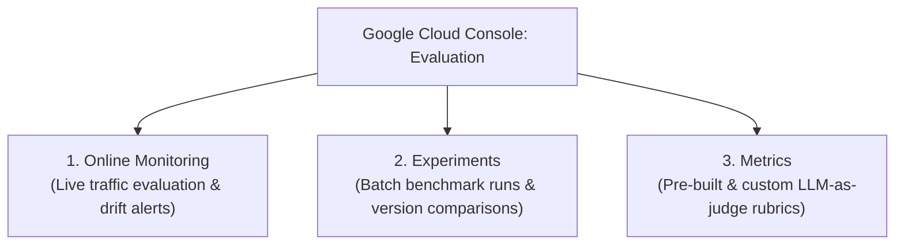

# Extend Luncher with integration to catering menu service

This is your task, with help from Antigravity. Build an agent that provides lunch menu options for scheduled meetings, pulled from the company's in-house catering service. Menu options are stored in BigQuery and can be accessed via MCP.

## Prerequisites

Ensure that you have the [`agents-cli` skills](https://github.com/google/agents-cli) and workspace plugins installed in Antigravity.

* **Antigravity 2.0:** Go to _Settings > Customizations_ and confirm that several `google-agents-cli-*` skills and the `eval-viewer` plugin are listed.
* **Antigravity CLI:** At the prompt, enter `/skills` and confirm that `google-agents-cli-*` and `eval-viewer` skills are listed.

## Step 1. Create the agent

### 1.1. Agent scaffolding

Initiate a `/grill-me` session, then enter the following prompt and answer any questions:

```
In the `agents` folder, create a new ADK agent named `cater_agent`. Its purpose is to provide catering menu options to serve at a lunch meeting.

Integrate the cater_agent with other agents as follows:
- when the `parallel_info_gatherer` agent invokes `strategy_agent` and `scheduling_agent`, also invoke `cater_agent` in parallel
- then pass the menu suggestions provided by cater_agent to parallel_info_gatherer, to synthesize into a proposal
- when `propose_lunch` is invoked, include a widget to select from the menu suggestions provided by `cater_agent`
- when the user submits their choices, save the catering menu along with the user's other selections

For the initial version, DO NOT implement any actual retrieval of menu items. Instead, always return a the following mock menu suggestions:
`{buffalo chicken wrap, mixed greens salad, chocolate cookie, assorted sodas},
 {veggie tacos, snow pea salad, apple tartlets, tea service},
 {lamb vindaloo, spiced cauliflower, naan, orange-mint spa water}
`
```

### 1.2. Run locally

Enter the following command to start the agents locally:

```
Start all the agents in `/agents/` locally, with hot reloading enabled. If any are already running, stop them and re-start them to reflect the most recent changes.
```

### 1.3. Validate local agent

Visit http://localhost:8080/dev-ui/?app=app and enter a prompt, like `plan a lunch meeting for tuesday`. Verify that the application continues to function, and now includes catering options

## Step 2. First deployment

### 2.1. Deploy

Enter the following prompt to deploy the new agent, and deploy updates to existing agents:
```
Deploy all agents to Agent Platform's Agent Runtime with telemetry and prompt/response logging enabled.
```

Alternatively, you can run the deployment commands directly:

```bash
source .env

BASE_ENV="GOOGLE_GENAI_MODEL=${GOOGLE_GENAI_MODEL},GOOGLE_GENAI_LOCATION=${GOOGLE_GENAI_LOCATION},GOOGLE_CLOUD_PROJECT_ID=${GOOGLE_CLOUD_PROJECT_ID},GOOGLE_CLOUD_LOCATION=${GOOGLE_CLOUD_LOCATION}"
AGENT_SETTINGS_ENV="GOOGLE_CLOUD_AGENT_ENGINE_ENABLE_TELEMETRY=true,OTEL_INSTRUMENTATION_GENAI_CAPTURE_MESSAGE_CONTENT=EVENT_ONLY,OTEL_SEMCONV_STABILITY_OPT_IN=gen_ai_latest_experimental"

# 1. Deploy cater_agent to Agent Runtime
uv --directory agents/cater_agent run agents-cli deploy \
  --project "$GOOGLE_CLOUD_PROJECT_ID" \
  --region "$GOOGLE_CLOUD_LOCATION" \
  --agent-identity \
  --update-env-vars "$BASE_ENV,$AGENT_SETTINGS_ENV,BIGQUERY_LOCATION=${BIGQUERY_LOCATION}"

# 2. Extract engine IDs and redeploy luncher_agent with all 3 sub-agents
STRAT_ENGINE_ID=$(jq -r '.remote_agent_runtime_id | split("/") | last' agents/strat_agent/deployment_metadata.json 2>/dev/null || echo "")
SCHED_ENGINE_ID=$(jq -r '.remote_agent_runtime_id | split("/") | last' agents/sched_agent/deployment_metadata.json 2>/dev/null || echo "")
CATER_ENGINE_ID=$(jq -r '.remote_agent_runtime_id | split("/") | last' agents/cater_agent/deployment_metadata.json 2>/dev/null || echo "")

uv --directory agents/luncher_agent run agents-cli deploy \
  --project "$GOOGLE_CLOUD_PROJECT_ID" \
  --region "$GOOGLE_CLOUD_LOCATION" \
  --agent-identity \
  --update-env-vars "$BASE_ENV,$AGENT_SETTINGS_ENV${STRAT_ENGINE_ID:+,STRATEGY_AGENT_ENGINE_ID=$STRAT_ENGINE_ID}${SCHED_ENGINE_ID:+,SCHEDULING_AGENT_ENGINE_ID=$SCHED_ENGINE_ID}${CATER_ENGINE_ID:+,CATERING_AGENT_ENGINE_ID=$CATER_ENGINE_ID}"
```

### 2.2. Validate deployed agent

When all deployments have completed, visit the deployed `luncher_agent` on Agent Runtime and confirm that the catering options are presented.

## Step 3. Access catering data via MCP

### 3.1. Initialize and review BigQuery dataset

Run the BigQuery seed script to create the `catering` dataset and populate the `menu_items` table:

```bash
./scripts/04-cater-agent-bq-seed.sh
```

In Google Cloud console, visit BigQuery and find dataset: `catering`. Within that dataset, find table: `menu_items`. Query it to explore the catering data it contains.

### 3.2. Add MCP connectivity

Initiate a `/grill-me` session, then enter the following prompt and answer any questions:

```
Add a tool to `cater_agent` named `fetch_catering_data`. It should connect to the GCP MCP endpoint for BigQuery, and use that server's `execute_sql` tool to query dataset/table `catering:menu_items` (in the same project that the agent is running in).

fetch_catering_data should return three proposed menus, each of which includes a main dish, a side, dessert, and beverage. Attempt to make each menu thematically consistent.

Update `propose_lunch` and associated methods in other agents to use the dynamically-fetched menu suggestions instead of mock data.
```

### 3.3. Test local agent

When the implementation is complete, visit http://localhost:8080/dev-ui/?app=luncher_agent and enter a prompt, like `plan a lunch meeting for tuesday`. Verify that the application continues to function, and that catering options are now dynamically generated

### 3.4. Redeploy

Run the following to redeploy the modified agents:

```
Redeploy the agents which have changed with telemetry and prompt/response logging enabled.
```

Alternatively, you can run the deployment command directly:

```bash
uv --directory agents/cater_agent run agents-cli deploy \
  --project "$GOOGLE_CLOUD_PROJECT_ID" \
  --region "$GOOGLE_CLOUD_LOCATION" \
  --agent-identity \
  --update-env-vars "$BASE_ENV,$AGENT_SETTINGS_ENV,BIGQUERY_LOCATION=${BIGQUERY_LOCATION}"
```

### 3.5. Validate local agent

When all deployments have completed, visit the deployed `luncher_agent` on Agent Runtime / Gemini Enterprise and confirm that catering options are now dynamically generated.

## Step 4. Store user preferences as memories

### 4.1. Add memory tools

Initiate a `/grill-me` session, then enter the following prompt and answer any questions:

```
Add a memory feature for dietary preferences. Requirements:
- when luncher_agent receives a prompt that appears to be a dietary preference specification, stop the lunch scheduling process. Instead, focus only on saving the dietary preference.
- cater_agent has a tool for storing user dietary preferences as memories
- when deployed to Agent Runtime, memories are stored using GEAP memory bank
- when running locally, memories are stored in local memory
- before querying for menus, consult the memory service for any stored dietary preferences
- if there are preferences, filter menu suggestions accordingly to present only menus that attendees will enjoy
- when the final response is delivered to the user, append text: "Are there any dietary preferences that I should consider? Specify them and I'll rememember them for the future."
- if the user prompt contains a dietary preference, store it as a memory instead of scheduling a meeting.
```

### 4.2. Validate local agent

When the implementation is complete, visit http://localhost:8080/dev-ui/?app=app and enter a preference prompt, like `my team doesn't like fish`. Verify that the application continues to function, and that catering options filter according to preferences.

> Note: when running locally, memories will be preserved within a session, but not across multiple sessions.

### 4.3. Redeploy

Run the following to redeploy the modified agents:

```
Redeploy the agents which have changed with telemetry and prompt/response logging enabled.
```

Alternatively, you can run the deployment command directly:

```bash
uv --directory agents/cater_agent run agents-cli deploy \
  --project "$GOOGLE_CLOUD_PROJECT_ID" \
  --region "$GOOGLE_CLOUD_LOCATION" \
  --agent-identity \
  --update-env-vars "$BASE_ENV,$AGENT_SETTINGS_ENV,BIGQUERY_LOCATION=${BIGQUERY_LOCATION}"
```

### 4.4. Validate deployed agent

When all deployments have completed, visit the deployed `luncher_agent` on Agent Runtime / Gemini Enterprise and confirm that memory tools are functional.

## Step 5. Add evaluations

Validate `cater_agent` using the `agents-cli eval` framework to test that it reliably generates themed menus, adheres to dietary constraints, and records memory preferences. This supports local developer iteration, regression testing, and cloud monitoring on Gemini Enterprise Agent Platform (GEAP).

### 5.1. Evaluation scaffolding

Initiate a `/grill-me` session, then enter the following prompt and answer any questions:

```
In `agents/cater_agent/tests/eval`, create an evaluation suite using the `agents-cli eval` framework:

1. Create dataset `tests/eval/datasets/catering-dataset.json` with evaluation cases covering:
   - Basic menu proposal: Requesting catering menu options for a lunch meeting and verifying 3 themed 4-course menus (main, side, dessert, beverage) are returned.
   - Dietary restrictions filtering: Requesting menus with constraints (e.g., vegetarian, gluten-free, no seafood/fish) and ensuring returned items strictly follow the restrictions.
   - Preference memory storage: Storing dietary preferences when prompted (e.g., allergies or restrictions) rather than attempting to schedule a meeting.

2. Create `tests/eval/eval_config.yaml` specifying:
   - `final_response_quality`: Built-in LLM-as-judge evaluating accuracy, formatting, and menu completeness.
   - `hallucination`: Built-in metric verifying all response facts are grounded in retrieved data.
   - `dietary_filtering`: Custom metric validating that all returned menus strictly adhere to requested dietary and allergen restrictions.
   - `agent_turn_count`: Turn counting metric.

3. Implement custom evaluator function in `tests/eval/dietary_filtering.py`.
```

### 5.2. Local developer loop

 During local development, quickly generate execution traces against your running agent and score them against your evaluation configuration.

 #### 5.2.1. Launch the evaluation dashboard sidecar (optional)

 The workspace includes an Antigravity sidecar plugin in `.agents/plugins/eval-viewer` that serves an interactive HTML dashboard and scorecard viewer on port **8088**.

 You can prompt Antigravity to start the sidecar:

 ```
 Start the eval-viewer sidecar server.
 ```

 #### 5.2.2. Run evaluation traces and grading

 You can prompt Antigravity to run the local evaluation flow:

 ```
 Run the eval suite for cater_agent:
 1. Ensure the local cater_agent server is running on port 8083 (with local in-memory state).
 2. Run `agents-cli eval generate` against http://localhost:8083 using `tests/eval/datasets/catering-dataset.json` and `--app-name app`.
 3. Grade the latest trace using `tests/eval/eval_config.yaml`.
 4. Output the score summary table and link to the grade results.
 ```

 Alternatively, you can execute `agents-cli` commands directly:

 ```bash
 # Generate traces from the local catering agent
 uv --directory agents/cater_agent run agents-cli eval generate \
   --dataset tests/eval/datasets/catering-dataset.json \
   --url http://localhost:8083 \
   --app-name app

 # Grade the generated traces against eval_config.yaml
 uv --directory agents/cater_agent run agents-cli eval grade \
   --traces artifacts/traces/ \
   --config tests/eval/eval_config.yaml
 ```

### 5.3. Analyze evaluation results and iterate (Quality Flywheel)

Review grade results to diagnose failures, adjust instructions or tools, and compare runs against your baseline to ensure scores improve without regressions.

You can prompt Antigravity to find the best baseline, analyze the latest results, and iterate on fixes:

```
Analyze the latest eval results for cater_agent against our baseline:
1. Identify our best evaluation baseline (`tests/eval/baselines/baseline_results.json` or highest scoring historical run) and the latest evaluation result in `agents/cater_agent/artifacts/grade_results/`.
2. Compare the candidate run against the baseline using `agents-cli eval compare`.
3. If any evaluation case failed or regressed:
   - Identify the root cause from the judge rationales and trace data.
   - Propose and apply fixes to `cater_agent` instructions or tool logic.
   - Re-run evaluation and verify scores meet or exceed the baseline.
4. Show the final scorecard and comparison summary.
```

Or manually inspect and compare runs:

1. **Review Grade Results:**
   Visit the local evaluation dashboard at **http://localhost:8088** (or open the generated HTML report in `agents/cater_agent/artifacts/grade_results/results_<timestamp>.html`) to inspect scorecards, judge explanations, and individual case traces.

2. **Diagnose and Fix Failures:**
   - **Low `dietary_filtering` score:** If excluded allergens appear in suggestions, adjust the system instructions in `app/agent.py` or enhance SQL query and memory filtering logic in `app/tools.py`.
   - **Low `final_response_quality` or `hallucination` score:** If menus lack 4 courses, miss thematic consistency, or mention items not in database results, clarify the prompt in `app/agent.py`.

3. **Compare Results Against Baseline:**
   Set the certified baseline and latest results paths into environment variables, then run `eval compare`:

   ```bash
   # 1. Set the certified baseline
   export EVAL_BASELINE="tests/eval/baselines/baseline_results.json"

   # 2. Automatically select the latest evaluation run
   export EVAL_NEW=$(ls -t agents/cater_agent/artifacts/grade_results/results_*.json | head -n 1 | sed 's|agents/cater_agent/||')

   # 3. Compare candidate run against the baseline
   uv --directory agents/cater_agent run agents-cli eval compare \
     "$EVAL_BASELINE" \
     "$EVAL_NEW"
   ```

> **Note (CI/CD Quality Gate):** If you were to implement this in a CI/CD pipeline (such as GitHub Actions or Cloud Build), you could run `eval grade` and `eval compare "$EVAL_BASELINE" "$EVAL_NEW"` automatically to block regressions before merging pull requests to the `main` branch.

### 5.4. Cloud evaluation and monitoring on Gemini Enterprise Agent Platform (GEAP)

For deployed agents on Agent Runtime, you can evaluate live conversation sessions, benchmark experiments, and define evaluation criteria directly in the **Google Cloud Console > Agent Platform > Evaluation** dashboard.

The **Evaluation** tab is divided into three core views:



#### 5.4.1. Online Monitoring (Evaluating Live Traffic)

With prompt/response logging enabled (`OTEL_INSTRUMENTATION_GENAI_CAPTURE_MESSAGE_CONTENT=EVENT_ONLY` and `GOOGLE_CLOUD_AGENT_ENGINE_ENABLE_TELEMETRY=true`), live interactions with your deployed agent are evaluated continuously:

1. **Navigate:** Open **[Google Cloud Console > Agent Platform > Evaluation > Online Monitoring](https://console.cloud.google.com/vertex-ai/evaluation/online-monitoring)**.
2. **Configure Monitoring Job:** Select your deployed agent (`cater-agent` or `luncher-agent`) and configure sample rate (e.g., 100% in development/testing, 5-10% in production).
3. **Inspect Real-Time Scores:** Monitor time-series score distributions, pass rates, and latency for live user sessions.
4. **Drill Down into Sessions:** Click on failing turns to inspect judge rationales and exact conversation payloads.

#### 5.4.2. Experiments (Batch Benchmarks & Model Comparisons)

Use the **Experiments** tab to compare different model iterations, prompts, or tool configurations against standard test datasets:

1. **Navigate:** Open **[Google Cloud Console > Agent Platform > Evaluation > Experiments](https://console.cloud.google.com/vertex-ai/evaluation/experiments)**.
2. **Create / Inspect Experiment:** View side-by-side radar charts, pass rates, and metric comparisons across agent revisions.
3. **Analyze Score Diffs:** Compare candidate performance against your baseline to certify zero regressions before publishing.

#### 5.4.3. Metrics (Evaluation Criteria Library)

The **Metrics** tab hosts the rubrics and scoring logic used by both Online Monitoring and Experiments:

1. **Navigate:** Open **[Google Cloud Console > Agent Platform > Evaluation > Metrics](https://console.cloud.google.com/vertex-ai/evaluation/metrics)**.
2. **Prebuilt Evaluators:** View standard GEAP metrics such as:
   - **Response Quality & Coherence**
   - **Groundedness & Hallucination Detection**
   - **Safety & Policy Adherence**
   - **Tool Use & Parameter Accuracy**
3. **Custom Evaluators:** Define domain-specific rubrics (such as our local `dietary_filtering` rule) to enforce organization-specific constraints.

#### 5.4.4. Live Distributed Tracing & Closing the Quality Flywheel

1. **Cloud Trace Explorer:** Navigate to **[Google Cloud Console > Trace > Trace explorer](https://console.cloud.google.com/traces/explorer)** to inspect end-to-end request latency across A2A sub-agents (`luncher_agent` ➔ `cater_agent`) and BigQuery MCP queries.
2. **Closing the Flywheel:** When an anomaly is detected in **Online Monitoring** or **Cloud Trace**, export the interaction into [`tests/eval/datasets/catering-dataset.json`](file:///home/user/Code/luncher/agents/cater_agent/tests/eval/datasets/catering-dataset.json) to expand local regression test coverage.

## Step 6. (optional). Learn from experience

Run `/learn` and follow the prompts to help Antigravity improve based on learnings from this session

## Step 7. Cleanup


### 7.1. Stop local servers

Enter the following prompt to stop local background processes before deploying:

```
Stop all locally running agents and processes.
```
---

| [⬅️ Previous: 3. Deploying to Cloud & Agent Platform Playground](3_deploy.md) | [📚 Getting Started](../README.md#getting-started) | [Next: 5. Registering to Gemini Enterprise ➡️](5_ge.md) |
| :--- | :---: | ---: |
