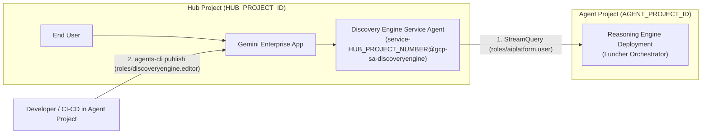

# Registering to Gemini Enterprise

This guide walks through registering the deployed **Luncher Orchestrator** into a **Gemini Enterprise (GE)** app using the Google Agents CLI (`agents-cli publish gemini-enterprise`).

---

## Step 1: Find your Gemini Enterprise App ID

1. Open the [Gemini Enterprise apps console](https://console.cloud.google.com/gemini-enterprise/apps).
2. Select the GCP project holding your Gemini Enterprise application.
3. Locate your application and copy the value in the **ID** column:


> **NOTE**
>
> Always use the **ID** (e.g., `gemini-enterprise-1781121851843`), **not** the app's display **Name** beside it. The display name will cause a `404 Engine "..." does not exist` error.

---

## Step 2: Publish the Agent to Gemini Enterprise

For agents deployed to **Agent Runtime** (Reasoning Engine), publish using **ADK mode** (`--registration-type adk`). This connects Gemini Enterprise directly to the Reasoning Engine deployment using Vertex AI's streaming query execution protocol.

### Prerequisites: Discovery Engine IAM Role
Grant the Discovery Engine Service Agent permission to invoke Vertex AI Reasoning Engines:

```bash
PROJECT_NUMBER=$(gcloud projects describe "$GOOGLE_CLOUD_PROJECT_ID" --format="value(projectNumber)")
gcloud projects add-iam-policy-binding "$GOOGLE_CLOUD_PROJECT_ID" \
  --member="serviceAccount:service-${PROJECT_NUMBER}@gcp-sa-discoveryengine.iam.gserviceaccount.com" \
  --role="roles/aiplatform.user" \
  --condition=None
```

### Method A: Antigravity Guided Flow (`/grill-me`)

If you are working with the Antigravity assistant, you can trigger an interactive publishing flow directly in chat:

1. Type `/grill-me` or prompt:
   ```text
   Help me publish Luncher Orchestrator to Gemini Enterprise interactively.
   ```
2. Antigravity will:
   - Discover and list active Gemini Enterprise apps across regions in your current GCP project.
   - Present an interactive selection prompt to confirm your app and target region.
   - Automatically extract the `remote_agent_runtime_id` from [`deployment_metadata.json`](../agents/luncher_agent/deployment_metadata.json).
   - Execute the registration on your behalf and provide the direct webapp testing URL.

### Method B: Direct Command (Programmatic / CI-CD)

Run `agents-cli publish gemini-enterprise` from the workspace. The CLI automatically reads [`deployment_metadata.json`](../agents/luncher_agent/deployment_metadata.json) and registers the Reasoning Engine:

```bash
# 1. Resolve Project Number and GE App Resource Path
PROJECT_NUMBER=$(gcloud projects describe "$GOOGLE_CLOUD_PROJECT_ID" --format="value(projectNumber)")
GE_APP_ID="<YOUR_GEMINI_ENTERPRISE_APP_ID>"  # e.g. gemini-enterprise-17881438_1788143851810
FULL_GE_APP_ID="projects/${PROJECT_NUMBER}/locations/global/collections/default_collection/engines/${GE_APP_ID}"

# 2. Publish to Gemini Enterprise via ADK mode
uv --directory agents/luncher_agent run agents-cli publish gemini-enterprise \
  --gemini-enterprise-app-id "${FULL_GE_APP_ID}" \
  --registration-type adk \
  --display-name "Luncher Orchestrator" \
  --description "The centralized Luncher Orchestrator that coordinates strategy-aligned team lunch meetings." \
  --project-id "$GOOGLE_CLOUD_PROJECT_ID"
```

---

## Step 3: Grant User Permissions in Gemini Enterprise

Publishing registers the agent with the app, but user access must be explicitly granted before the agent will respond to queries:

1. In the Google Cloud Console, navigate to **Gemini Enterprise > Apps > [Your App] > Agents**.
2. Click on **Luncher Orchestrator**.
3. Go to the **User permissions** tab and click **Add user**:


4. Add your user email (or select **All users** to enable access across your organization) and assign the **Agent User** role.

> **NOTE**
>
> The console tab may show: *"This agent is not integrated with Agent Registry and Gateway policies will not be applied."* This is standard and expected for an A2A registration.

---

## Step 4: Test in the Gemini Enterprise Webapp

Interact with the deployed orchestrator in the Gemini Enterprise web interface.

1. **Open the webapp:** Navigate to **Gemini Enterprise > [Your App] > Overview** and open the URL under *"Your Gemini Enterprise webapp is ready"*:
   ```
   https://vertexaisearch.cloud.google.com/home/cid/<YOUR_APP_CID>
   ```
2. **Select the agent:** In the left navigation rail, choose **Agents**. Select **Luncher Orchestrator** from the **From your organization** section.
3. **Send a prompt:**
   ```text
   Plan a team lunch meeting for next week that aligns with our corporate strategy.
   ```
4. **Verify multi-agent execution:**
   - The orchestrator concurrently queries `strat_agent`, `sched_agent`, and `cater_agent` via A2A.
   - It synthesizes and renders the formatted Markdown proposal with strategic rationale, team member availability, ranked time slots, and catering menu options.
5. **Multi-turn confirmation:** Reply with `"Book Tuesday 12:00 with Menu 1"` to test delegation to `sched_agent` and booking creation in the Memory Bank.

---

## Managing & Troubleshooting Registrations

### List Registered Apps

To view all available Gemini Enterprise apps across regions in your project:

```bash
uv --directory agents/luncher_agent run agents-cli publish gemini-enterprise --list --project-id "$GOOGLE_CLOUD_PROJECT_ID"
```

### Updating an Existing Registration

Re-running the `agents-cli publish gemini-enterprise` command with updated parameters or after redeploying automatically updates the existing agent registration in place (via `PATCH`) matching on the agent card URL.

---

## Cross-Project Agent Publishing (Hub & Agent Pattern)

In enterprise architectures, organizations often maintain a centralized **Hub project** hosting the enterprise-wide Gemini Enterprise application, while autonomous domain teams build and deploy agents in dedicated **Agent projects**.



### Environment Variables Reference

| Variable | Description | Example |
| :--- | :--- | :--- |
| `HUB_PROJECT_ID` | Project ID holding the centralized Gemini Enterprise application | `prj-corp-hub` |
| `HUB_PROJECT_NUMBER` | GCP Project number for the Hub project | `123456789012` |
| `HUB_GE_APP_ID` | Gemini Enterprise App Engine ID in the Hub project | `gemini-enterprise-17881438_1788143851810` |
| `AGENT_PROJECT_ID` | Project ID where the agent is deployed | `prj-team-luncher` |

---

### Step 1: Grant Discovery Engine Invocations in the Agent Project

The Discovery Engine Service Agent originating in the **Hub project** needs permission to invoke Reasoning Engines in the **Agent project**:

```bash
HUB_PROJECT_NUMBER="<HUB_PROJECT_NUMBER>"
AGENT_PROJECT_ID="<AGENT_PROJECT_ID>"

gcloud projects add-iam-policy-binding "${AGENT_PROJECT_ID}" \
  --member="serviceAccount:service-${HUB_PROJECT_NUMBER}@gcp-sa-discoveryengine.iam.gserviceaccount.com" \
  --role="roles/aiplatform.user" \
  --condition=None
```

---

### Step 2: Grant Publishing Permissions in the Hub Project

The developer or CI/CD service account publishing from the **Agent project** needs permissions to register agents in the **Hub project's** Discovery Engine application:

```bash
HUB_PROJECT_ID="<HUB_PROJECT_ID>"
PUBLISHER_IDENTITY="user:developer@example.com"  # or serviceAccount:sa-deploy@AGENT_PROJECT_ID.iam.gserviceaccount.com

gcloud projects add-iam-policy-binding "${HUB_PROJECT_ID}" \
  --member="${PUBLISHER_IDENTITY}" \
  --role="roles/discoveryengine.editor" \
  --condition=None
```

---

### Step 3: Publish from the Agent Project

From the Agent project workspace, execute `agents-cli publish gemini-enterprise` pointing to the Hub's application resource path:

```bash
HUB_PROJECT_ID="<HUB_PROJECT_ID>"
HUB_PROJECT_NUMBER="<HUB_PROJECT_NUMBER>"
HUB_GE_APP_ID="<HUB_GE_APP_ID>"

# Build Hub Gemini Enterprise resource path
FULL_HUB_GE_APP_ID="projects/${HUB_PROJECT_NUMBER}/locations/global/collections/default_collection/engines/${HUB_GE_APP_ID}"

# Publish to Hub Gemini Enterprise app via ADK mode
uv --directory agents/luncher_agent run agents-cli publish gemini-enterprise \
  --gemini-enterprise-app-id "${FULL_HUB_GE_APP_ID}" \
  --registration-type adk \
  --display-name "Luncher Orchestrator" \
  --description "The centralized Luncher Orchestrator that coordinates strategy-aligned team lunch meetings." \
  --project-id "${HUB_PROJECT_ID}"
```

---

### Step 4: Grant User Entitlements in Hub Console

In the **Hub project's** Cloud Console:
1. Navigate to **Gemini Enterprise > Apps > [Hub App] > Agents > Luncher Orchestrator**.
2. Go to **User permissions > Add user** and grant the **Agent User** role to the target users or groups.

---

## Also Worth Inspecting

- **Sub-agents in Agent Platform:** Open **Console > Agent Platform > Agents > Deployments**, then select `strat-agent`, `sched-agent`, or `cater-agent`. Use the **Playground** tab to prompt an individual sub-agent directly to isolate backend issues.
- **Project Telemetry & Logs:** Open **Console > Logging > Log Explorer** and **Cloud Trace** to inspect end-to-end execution traces, spans, and payload attributes across orchestrator and sub-agent turns.

---

| [⬅️ Previous: 4. Extending Luncher with a catering agent](4_cater_agent.md) | [📚 Getting Started](../README.md#getting-started) | [Next: 6. Cleanup ➡️](6_cleanup.md) |
| :--- | :---: | ---: |