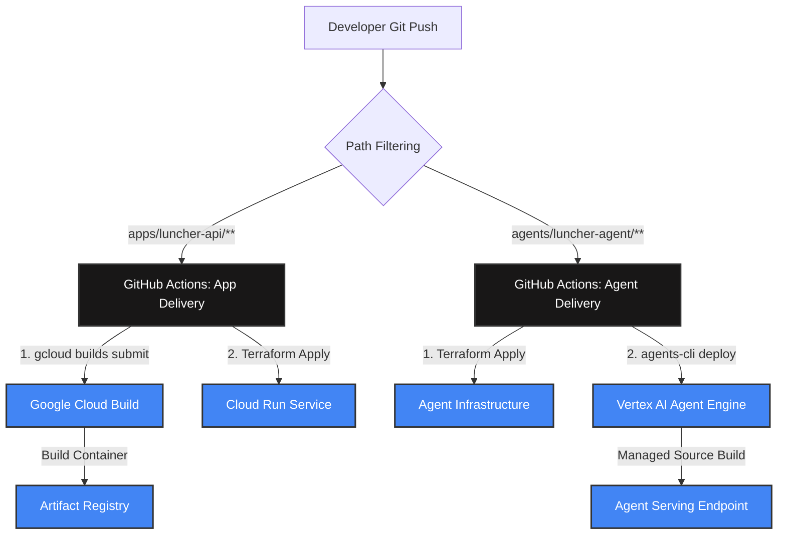

# Monorepo CI/CD Pipeline Architecture

This document describes the continuous integration and continuous delivery (CI/CD) architecture for the Luncher workshop. It details how changes are detected, where code is compiled, and how deployments are orchestrated securely inside Google Cloud.

---

## 🏗️ Monorepo Pipeline Overview

In an enterprise-grade monorepo, multiple isolated software assets coexist. To prevent updates to one component from trigger-deploying another, we use **GitHub Actions Path Filtering** in the orchestration layer, and delegate the physical build and hosting workloads entirely to **Google Cloud Build** and **Vertex AI**.



---

## 1. 🌐 The Mock Backend Pipeline (`apps/luncher-api`)

The REST backend is deployed as a Dockerized container on **Google Cloud Run**.

### 🔍 Change Detection
Triggered automatically via `.github/workflows/app-delivery.yaml` when changes occur inside the backend directory:
```yaml
on:
  push:
    branches: [ main ]
    paths:
      - 'apps/luncher-api/**'
```

### 🔨 Cloud Build Spec Location
The physical build spec is located in:
🔗 **[apps/luncher-api/app/cloudbuild.yaml](file:///home/user/antigravity/projects/luncher/apps/luncher-api/app/cloudbuild.yaml)**

### ⚙️ How the Backend Build Works:
1. **Source Upload**: GitHub Actions triggers the build via:
   ```bash
   gcloud builds submit "./apps/luncher-api/app" --config ./apps/luncher-api/app/cloudbuild.yaml
   ```
2. **Containerization**: Google Cloud Build pulls the source, reads the `Dockerfile` inside `apps/luncher-api/app/`, and compiles the Flask production image.
3. **Registry Storage**: The compiled container image is securely pushed into the project's private **Artifact Registry**.
4. **Infra Rollout**: GitHub Actions runs `terraform apply` targeting `apps/luncher-api/terraform/` to update the Cloud Run instance to point to the new image digest.

---

## 2. 🤖 The Agent Pipeline (`agents/luncher-agent`)

The Agent is deployed as a managed service on the **Vertex AI Agent Engine** (Agent Runtime).

### 🔍 Change Detection
Triggered automatically via `.github/workflows/agent-delivery.yaml` (or manually via CLI) when files inside the agent directory change:
```yaml
on:
  push:
    branches: [ main ]
    paths:
      - 'agents/luncher-agent/**'
```

### ❓ Where is the Cloud Build Spec for the Agent?
Unlike the backend, **there is NO explicit `cloudbuild.yaml` file in the agent codebase.**

This is a key feature of the **Vertex AI Agent Runtime source-based deployment model**:
* **Fully Managed Build**: The build template is maintained server-side by Google Cloud.
* **Declarative Configuration**: The environment definition is parsed directly from your **[agents-cli-manifest.yaml](file:///home/user/antigravity/projects/luncher/agents/luncher-agent/agents-cli-manifest.yaml)** and **`pyproject.toml`** files.

### ⚙️ How the Agent Build Works:
1. **Requirements Export**: The `agents-cli` deploy process runs `uv export --format requirements-txt` behind the scenes to compile a clean, locked list of dependencies (`.requirements.txt`).
2. **Source Bundling**: The Python source files (the entire `app/` folder containing graphs, agents, and custom tools) are bundled into a zipped tarball.
3. **Google GCS Upload**: The bundle is uploaded directly to a secure **Google Cloud Storage (GCS) staging bucket**.
4. **Vertex AI Source Build**: Vertex AI receives the zip, triggers an internal managed Cloud Build container on Google's private infrastructure, installs the exact locked requirements, packages the `AdkApp` wrapper, and registers it to Vertex AI's managed registry.
5. **Auto-serving**: Vertex AI spins up the managed serving endpoint with built-in telemetry, session caching, and scale-to-zero capabilities.

---

## 📊 Deployment Pattern Comparison

| Feature | Mock Backend API (`apps/luncher-api`) | Luncher Agent (`agents/luncher-agent`) |
| :--- | :--- | :--- |
| **Hosting Target** | Google Cloud Run | Vertex AI Agent Runtime |
| **Deployment Model** | Container-based | **Source-based** (Managed) |
| **Local Build Files** | `Dockerfile`, `cloudbuild.yaml` | **None** (Fully parsed from `pyproject.toml`) |
| **Build Location** | User's GCP Project (Cloud Build) | Managed Vertex AI Server-side Builder |
| **Artifact Stored** | Docker Container Image | Source Zip Bundle (GCS) + Compiled Image |
| **Infrastructure Deployment** | **Terraform Apply** (`apps/luncher-api/terraform`) | **Terraform Apply** (`agents/luncher-agent/deployment/terraform/single-project`) |
| **Code / Service Deployment** | Automated via Cloud Run service update pointing to build digest | Automated via **`agents-cli deploy`** (overwriting reasoning engine source archive) |
| **Session Support** | Stateless (In-Memory / Database) | Native `VertexAiSessionService` (Persistent) |

---

## 🛠️ Local Development Mirroring

Because the build and deployment logic is encapsulated in standard configurations (`cloudbuild.yaml` and `agents-cli-manifest.yaml`), developers can replicate the exact production CI/CD behaviors directly from their terminal:

```bash
# Deploys the Mock API exactly like the CI/CD trigger:
gcloud builds submit "./apps/luncher-api/app" --config ./apps/luncher-api/app/cloudbuild.yaml

# Deploys the Agent exactly like the CI/CD trigger:
cd agents/luncher-agent && agents-cli deploy
```
