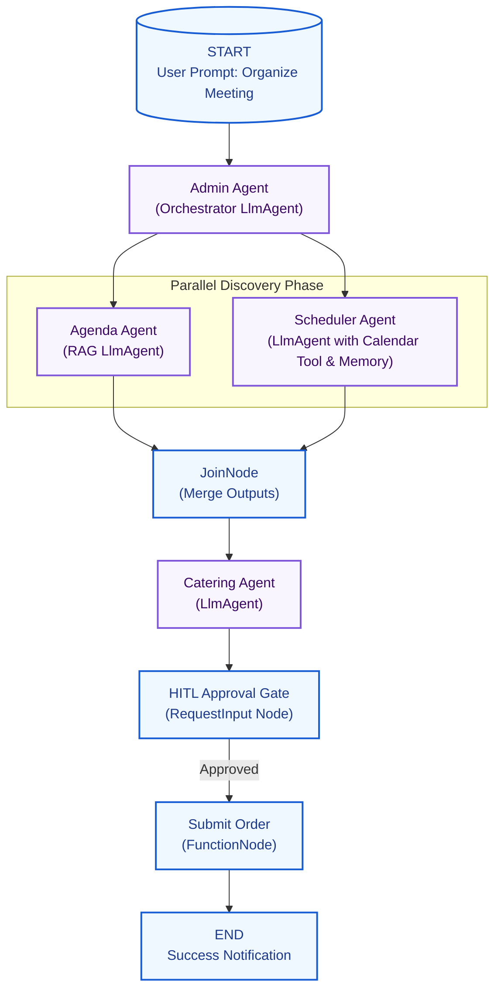

# 🍔 Workshop Tutorial: Building the Luncher Meeting & Catering Coordinator

## 🎓 Master Step-by-Step Instructor & Developer Guide

Welcome to the **Luncher Agent Platform SDLC Workshop**! In this self-paced or instructor-led lab, you will build a highly sophisticated corporate virtual coordinator. By the end of this workshop, you will master the full agent development lifecycle—from project creation and graph-based workflow orchestrations to systematic evaluation and secure cloud deployment.

---

## 🏗️ 1. Architecture Overview

Your application implements a collaborative multi-agent pattern designed to automate the coordination of internal working sessions with catered lunch. It uses **ADK 2.0 graph-based workflows** to achieve:
1.  **Central Orchestration**: An **Admin Agent** acts as the central coordinator, parsing the user prompt and delegating subtasks.
2.  **Parallel Discovery**: Fanning out tasks simultaneously:
    *   **Agenda Agent**: Drafts a meeting agenda grounded in the company's rules/docs corpus.
    *   **Scheduler Agent**: Queries a **Calendar Service** tool and retrieves team food preferences from a persistent **Memory Bank**.
3.  **State Consolidation**: Merging parallel data outputs using a `JoinNode` into a single, comprehensive state payload.
4.  **Context-aware Catering Selection**: A **Catering Agent** selects ideal menu options matching the consolidated schedules, dietary restrictions, and budget caps.
5.  **State Checkpointing (HITL)**: Interrupting execution at an approval gate to await human verification before final purchases.



---

## 🛠️ 2. Prerequisite Setup

Before diving into the exercises, authenticate with Google Cloud and initialize your environment:

```bash
# 1. Authenticate with your Google Cloud account
gcloud auth login
gcloud auth application-default login

# 2. Check the available Make tasks
make help
```

---

## 📖 3. Step-by-Step Exercises

### 🏁 Exercise 1: Project Scaffolding
In this exercise, you will create a fresh, clean Agent project structure configured for deployment to Vertex AI Agent Runtime.

Run the scaffolding command from the root of the repository:
```bash
agents-cli scaffold create agents/luncher-agent --agent adk --deployment-target agent_runtime --prototype
```

#### What was created?
*   `agents/luncher-agent/app/agent.py`: Your primary agent registration file.
*   `agents/luncher-agent/pyproject.toml`: Manages dependencies including `google-adk`.
*   `agents/luncher-agent/tests/`: Boilerplate testing folder structure.
*   `agents/luncher-agent/agents-cli-manifest.yaml`: Manifest file containing CLI configuration.

To support ADK 2.0's experimental workflow graph capabilities, open `agents/luncher-agent/pyproject.toml` and verify that the `google-adk` dependency is upgraded:
```toml
dependencies = [
    "google-adk>=2.0.0a1",
    ...
]
```

---

### 📡 Exercise 2: Mock API & MCP Setup
To ensure developers can test their code with zero complex cloud dependencies, we run a local Python Flask server simulating external corporate Calendar databases and the Luncher Catering vendor inventory.

1.  **Launch the mock backend**:
    ```bash
    make run-backend
    ```
    This launches the Flask app on `http://localhost:8080`.
2.  **Verify Endpoints**:
    *   `GET http://localhost:8080/catering`: Lists cuisines, menus, pricing, and vendor details.
    *   `GET http://localhost:8080/calendar`: Lists attendee calendar busy-blocks.
    *   `POST http://localhost:8080/orders`: Accepts a restaurant, items list, and returns a transaction tracking ID.

*(Advanced Extension)*: In an enterprise setting, you can wrap these Flask endpoints inside a **Model Context Protocol (MCP)** server, making these tools dynamically discoverable by any Agent Engine instance.

---

### 💻 Exercise 3: Subagents & Core Tool Coding
Now we implement the core agent logic and tools. Open `agents/luncher-agent/app/tools.py` and `agents/luncher-agent/app/agent.py`.

#### Step 1: Write Custom Tools (`tools.py`)
These tools use `urllib.request` to query your local Flask microservices:
1.  `query_agenda_guidelines`: Reads company policies directly from `docs/meeting_guidelines.md` (acting as a zero-setup local RAG grounding source).
2.  `get_calendar_availability`: Fetches employee calendar blocks from `/calendar`.
3.  `search_catering`: Filters available restaurants from `/catering` by cuisine.
4.  `submit_catering_order`: Posts the selected order menu to `/orders`.

#### Step 2: Implement Persistent Memory Bank
Open `agent.py` and verify how employee preferences (like Bob being vegetarian or Alice gluten-free) are kept persistently using ADK's **Memory Bank**:
```python
# Reads/Writes team preferences persistently to the session state context
dietary = ctx.state.get("team_dietary_preferences")
if not dietary:
    dietary = ["Gluten-Free", "Vegetarian"]
    ctx.state["team_dietary_preferences"] = dietary
```

---

### 🔗 Exercise 4: ADK 2.0 Graph Workflow & HITL Approval
In this exercise, you will wire your individual nodes into an end-to-end execution graph.

#### Step 1: Parallel Fan-Out
We declare parallel edges from `START` to execute the RAG Agenda planner and the schedule checker simultaneously:
```python
edges=[
    (START, agenda_agent),
    (START, get_preferences),
]
```

#### Step 2: Fanning-In and Merging State
We use a `JoinNode` to collect the parallel branch results. The downstream `plan_catering` node receives a merged dictionary where the outputs are keyed by their producing node names:
```python
join_phase = JoinNode(name="merge_planning_phase")

@node
def plan_catering(ctx: Context, node_input: dict) -> CateringDraft:
    agenda = node_input["agenda_agent"]["agenda_markdown"]
    preferences = node_input["get_preferences"]
    ...
```

#### Step 3: Human-in-the-Loop (HITL) Checkpointing
To prevent unauthorized purchases, we use `RequestInput` to pause execution. By defining `ResumabilityConfig(is_resumable=True)`, the platform saves the graph state to database checkpoints, letting us resume the workflow safely once the human responds.
```python
async def hitl_approval(ctx: Context, node_input: CateringDraft):
    if not ctx.resume_inputs:
        yield RequestInput(
            interrupt_id="catering_order_approval",
            message=f"Please approve catering from {node_input.restaurant} labeling total ${node_input.total_cost:.2f}. Reply with 'approve' or 'reject'."
        )
        return
```

---

### 🧪 Exercise 5: Systematic Evaluation
A robust AI lifecycle requires systematic evaluation. Unlike unit tests, evaluations grade the non-deterministic output of LLM reasoning.

1.  **Define Evalset Cases (`tests/eval/datasets/luncher-evalset.json`)**:
    We create input prompts along with their expected tool execution trajectories:
    ```json
    {
      "eval_id": "tech_kickoff_eval",
      "user_content": { "parts": [{ "text": "Organize a Technical Kickoff for Alice, Bob, and Charlie" }] },
      "intermediate_data": {
        "tool_uses": [
          { "name": "query_agenda_guidelines" },
          { "name": "get_calendar_availability" },
          { "name": "search_catering" }
        ]
      }
    }
    ```
2.  **Configure Quality Rubrics (`tests/eval/eval_config.yaml`)**:
    We set up two custom metrics evaluated by an LLM-as-judge:
    *   `agenda_relevance`: Grader verifies that timing slots strictly match Acme templates and citations are printed.
    *   `dietary_compliance`: Grader checks if the selected food items respect the dietary needs retrieved from Bob and Alice's memory bank profiles.
3.  **Run the Evaluations**:
    ```bash
    make eval
    ```
    Analyze the detailed score table and iterate on your prompts/instructions to fix any failures.

---

### 🚀 Exercise 6: Cloud Deployment & Publishing

Once evaluations achieve 100% compliance, deploy the solution:

1.  **Deploy to Cloud Run**:
    ```bash
    make deploy
    ```
    This triggers a Google Cloud Build compile, pushes the container to Artifact Registry, and deploys it as a secure Cloud Run service.
2.  **Register to Gemini Enterprise**:
    ```bash
    cd agents/luncher-agent && agents-cli publish gemini-enterprise
    ```
    This registers your ADK-based agent as a shared enterprise service on the Agent Platform, making it directly available for business teams to interact with from their chat console!

---

## 🏆 Summary Checklist for Instructors
Before delivering this workshop, make sure you have:
*   [x] Started the backend and verified `http://localhost:8080/catering` is live.
*   [x] Ensured participants cloned the repository and ran `make install-deps`.
*   [x] Provided copies of `docs/meeting_guidelines.md` for grounding tests.
*   [x] Configured Google Cloud project quotas to allow deployment of serverless containers.
