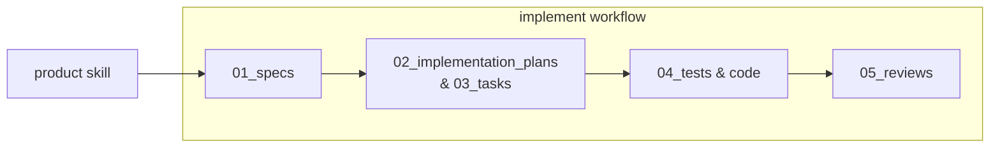

# Software Development Lifecycle (SDLC)

Automated feature development pipeline using specialized agents, skills, and workflows.

## Pipeline Overview

## Usage
These SDLC agents run in two phases, each invoked by a human:

A. use the `/product` skill (with no prompt text) to interactively construct a spec, which will be saved to `01_specs`
B. then, use the `/workflow` skill (with no prompt text) to kick off the agent team to implement any unimplemented specs.

## Folder Structure & Lifecycle

1. [`01_specs/`](01_specs/): Feature specifications (`NNNN_short-name.md`) created via [`product`](../.agents/skills/product/SKILL.md) skill and [`product_manager`](../.agents/agents/product_manager/prompt.md) agent.
2. [`02_implementation_plans/`](02_implementation_plans/): Architectural blueprints created by [`architect`](../.agents/agents/architect/prompt.md) agent.
3. [`03_tasks/`](03_tasks/): Task breakdowns (`NNNN_short-name/task_XX.md`) executed concurrently by [`engineer`](../.agents/agents/engineer/prompt.md) and [`test_writer`](../.agents/agents/test_writer/prompt.md) agents.
4. [`04_tests/`](04_tests/): Automated test suites for feature verification.
5. [`05_reviews/`](05_reviews/): Quality and security review reports created by [`reviewer`](../.agents/agents/reviewer/prompt.md) agent.

## Triggers & Components

- **New Feature**: Trigger [`product`](../.agents/skills/product/SKILL.md) skill to gather requirements, branch, and save spec in `01_specs/`.
- **Implementation**: Trigger [`implement`](../.agents/workflows/implement.md) workflow (or [`implement`](../.agents/skills/implement/SKILL.md) skill) to execute stages 02 through 05.
