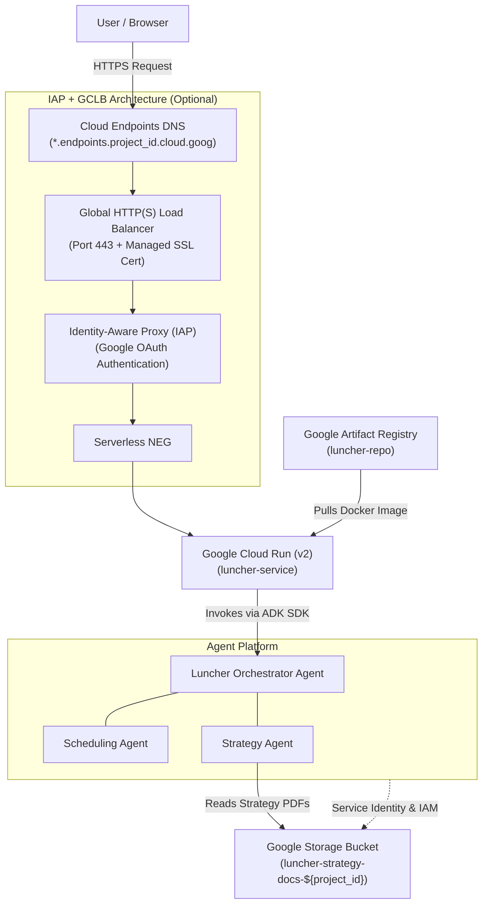

# Luncher Terraform Infrastructure Documentation

This directory contains the Terraform configuration for provisioning and managing the Google Cloud Platform (GCP) infrastructure for the **Luncher** application.

---

## Architecture Overview

The Terraform configuration sets up a secure, serverless environment on GCP that links container execution, AI model runtime, strategy document storage, and optional zero-trust web access via Global HTTP(S) Load Balancing with Identity-Aware Proxy (IAP) and Cloud Endpoints DNS.



---

## Provisioned Resources & Services

### Summary Table

| GCP Service | Resource Type | Resource Name / ID | Purpose |
| :--- | :--- | :--- | :--- |
| **Artifact Registry** | `google_artifact_registry_repository` | `luncher-repo` | Docker registry for application container images |
| **Cloud Run** | `google_cloud_run_v2_service` | `luncher-service` | Fully managed serverless container service hosting the app |
| **Cloud Storage** | `google_storage_bucket` | `luncher-strategy-docs-${project_id}` | Bucket storing strategy PDF documents used by the agent |
| **Vertex AI** | `google_project_service_identity` | `aiplatform_sa` | Service identity required for Vertex AI Platform / Reasoning Engine |
| **IAP Service Identity** | `google_project_service_identity` | `iap_sa` | Service identity created for Identity-Aware Proxy (`service-<PROJECT_NUMBER>@gcp-sa-iap.iam.gserviceaccount.com`) |
| **Cloud Endpoints** | `google_endpoints_service` | `luncher.${project_id}.endpoints.${project_id}.cloud.goog` | Free Google-managed DNS pointing to Load Balancer IP |
| **Compute Engine** | `google_compute_global_address` | `luncher-lb-ip` | Reserved global public IPv4 address for GCLB |
| **Compute Engine** | `google_compute_managed_ssl_certificate` | `luncher-ssl-cert` | Google-managed SSL/TLS certificate for Cloud Endpoints domain |
| **Compute Engine** | `google_compute_backend_service` | `luncher-backend-service` | GCLB backend service with IAP enabled |
| **IAP** | `google_iap_web_backend_service_iam_member` | `users` | Grants `roles/iap.httpsResourceAccessor` to authorized Google accounts |
| **IAM** | `google_cloud_run_v2_service_iam_member` | `iap_invoker` | Grants `roles/run.invoker` to IAP service account on Cloud Run |
| **IAM** | `google_cloud_run_v2_service_iam_member` | `lb_invoker` | Grants `roles/run.invoker` to domain/users (access enforced at IAP layer) |

---

## Detailed Resource Specifications

### 1. Artifact Registry Repository
* **Resource**: `google_artifact_registry_repository.registry`
* **Format**: `DOCKER`
* **Repository ID**: `luncher-repo`
* **Description**: Holds pushed container images built via local workflows or GitHub Actions.

### 2. Cloud Run Service (v2)
* **Resource**: `google_cloud_run_v2_service.default`
* **Service Name**: `luncher-service`
* **Ingress**: `INGRESS_TRAFFIC_INTERNAL_LOAD_BALANCER` (Direct public access blocked; traffic must route through Load Balancer)
* **Resources**: 1 GiB Memory Limit, container port `8080`
* **Environment Variables**:
  * `GOOGLE_GENAI_USE_VERTEXAI`: Set to `"true"`
  * `GOOGLE_CLOUD_PROJECT`: Project ID
  * `GOOGLE_CLOUD_LOCATION`: Region (e.g., `us-central1`)
  * `STRATEGY_DOCS_BUCKET`: Target Cloud Storage bucket name

### 3. IAP + Global HTTP(S) Load Balancer Sub-Module (`modules/iap_gclb`)
Provisions a production-grade external HTTP(S) load balancer protected by Google Identity-Aware Proxy (IAP) without purchasing a custom domain:
* **Cloud Endpoints DNS**: Registers `luncher.<project_id>.endpoints.<project_id>.cloud.goog` pointing to the GCLB IP.
* **Managed TLS Certificate**: Auto-provisions and auto-renews Google TLS certificates.
* **IAP Authentication**: Protects the backend so only users in `var.iap_members` can access the application.
* **HTTP to HTTPS Redirect**: Automatically redirects HTTP port 80 traffic to HTTPS port 443.

---

## Requirements

| Provider / Tool | Version |
| :--- | :--- |
| **Terraform** | `>= 1.6.0` |
| **google** | `~> 5.40.0` |
| **google-beta** | `~> 5.40.0` |

---

## Inputs & Variables

| Name | Description | Type | Default | Required |
| :--- | :--- | :--- | :--- | :---: |
| `project_id` | The Google Cloud project ID to deploy resources to. | `string` | n/a | **Yes** |
| `region` | The primary region for Google Cloud resource deployments. | `string` | `"us-central1"` | No |
| `image_url` | The initial container image URL to deploy to Cloud Run. | `string` | `"us-docker.pkg.dev/cloudrun/container/hello"` | No |
| `iap_client_id` | OAuth 2.0 Client ID for IAP. Enabling this provisions the Load Balancer + IAP module. | `string` | `""` | No |
| `iap_client_secret` | OAuth 2.0 Client Secret for IAP. | `string` | `""` | No |
| `iap_members` | List of IAM members granted `roles/iap.httpsResourceAccessor` (e.g., `user:alice@example.com`). | `list(string)` | `[]` | No |

---

## Outputs

| Name | Description |
| :--- | :--- |
| `artifact_registry_repo` | The name of the created Artifact Registry repository. |
| `cloud_run_url` | The internal Cloud Run service URI. |
| `iap_endpoint_url` | The secure HTTPS Cloud Endpoints URL protected by IAP (`https://luncher.<project_id>.endpoints.<project_id>.cloud.goog`). |
| `iap_load_balancer_ip` | Reserved global IP address of the External Load Balancer. |
| `proxy_command` | Pre-formatted `gcloud` command to open an authenticated local proxy tunnel. |

---

## Deployment & Usage

### 1. Prerequisites
Ensure you have created OAuth 2.0 Credentials (Client ID & Secret) for IAP in Google Cloud Console under **APIs & Services > Credentials** (Web application type, redirect URI `https://iap.googleapis.com/v1/oauth/clientIds/YOUR_CLIENT_ID:handleRedirect`).

### 2. Configure Variables
Create a `terraform.tfvars` file:
```hcl
project_id        = "your-gcp-project-id"
region            = "us-central1"
iap_client_id     = "YOUR_CLIENT_ID.apps.googleusercontent.com"
iap_client_secret = "YOUR_CLIENT_SECRET"
iap_members       = [
  "user:alice@example.com",
  "domain:example.com"
]
```

### 3. Initialize & Deploy
```bash
terraform init -backend-config="bucket=your-tf-state-bucket"
terraform plan
terraform apply
```
